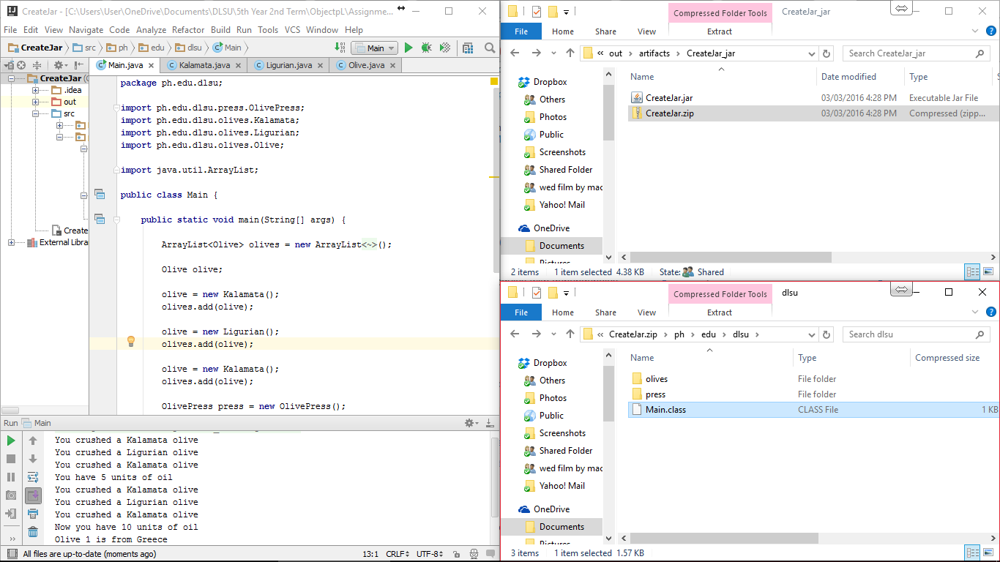

#CreateJar

Trying to build a jar file.

#ScreenShot

#Code

*Code will depend on the project you are trying to place in a jar file.*

#Process
*This applies on IntelliJ IDE.*
  1. File > Project Structure > Artifacts > click the add button > JAR > From modules with dependencies > Extract to the target Jar > Ok
  2. Build > Build Artifacts > projectname:jar > Build
